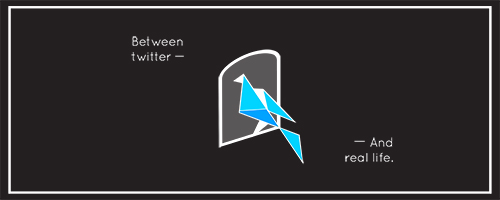

<h1 align=center>
  
</h1>

# Twitter Memo Web-Application

## 트위터에서 한 메모만 모아서 보자!

트위터에서 한 메모, 마음을 찍어놔도 찾기 어려웠죠.

이젠 걱정 없이 트위터에 써놓은 메모를 모아 볼 수 있도록 해 봐요 ㅇㅅ<

------------------

## 스펙
### 환경
- Python 3

### 라이브러리
- [Tweepy](https://github.com/tweepy/tweepy)
- [Flask](https://github.com/pallets/flask)
- [SQLAlchemy](https://github.com/zzzeek/sqlalchemy)

## TODO
- [ ] Web 구현
- [ ] Twitter Stream Reader 구현
- [ ] Web - Twitter Stream Reader 구현
- [ ] README에 사용 방법 작성

## Contributors
- artist_DALVIN
- [@JungWinter](https://github.com/JungWinter)
- [@Maisie](https://github.com/pinkrespect)
